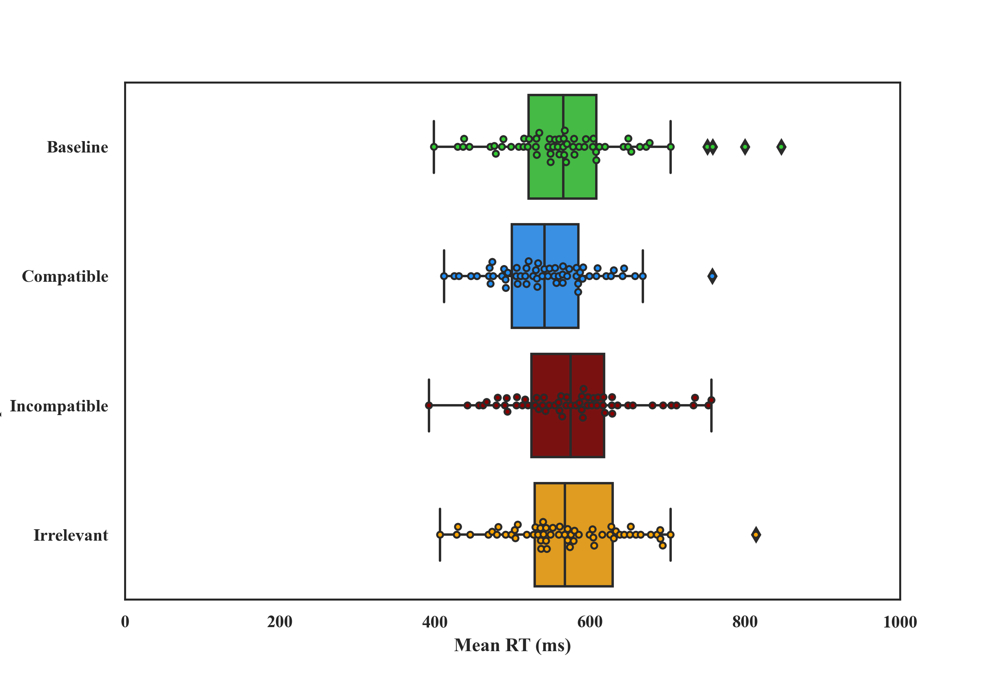
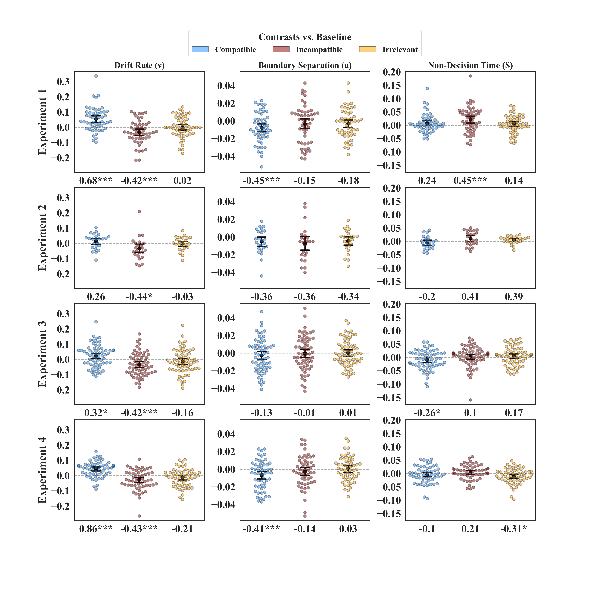

## Automatically Controlled: Task-Irrelevance Fully Cancels Otherwise Automatic Imitation
### Hemed E, Mark-Tavger I., Hertz U., Bakbani-Elkayam S., & Eitam B. (In press, *Journal of Experimental Psychology: General*)
#### Corresponding author: [Eitan Hemed](mailto:Eitan.Hemed@gmail.com)

___
### About  
This repository contains the [accepted manuscript](./Manuscript.pdf), 
a text document of the [supplementary materials](./Supplementary%20material.pdf) 
and all code and data required to reproduce the analyses
and plots included in the paper. 

If you find any errors or inaccuracies in the code or documentation,
please submit an [issue](
https://github.com/EitanHemed/automatically_controlled/issues) 
or email [Eitan Hemed](mailto:Eitan.Hemed@gmail.com) directly.

---
### How-To
[AuimPy](./auimpy) consists of classes and functions used 
to pre-process, analyze and plot the study data. The data is
saved in the individual experiment directories (e.g., `./exp_2/input`).
The code generates plots and print-ready formatted textural reports that will be saved in the respective 
experiment directories (e.g., `./exp_4/output/texts`).

1. For exploratory data analysis or reproducing the statistical analysis and plots for a single experiment:
* Open the Jupyter Notebook of the required experiment
(e.g., `./exp1/exp1.ipynb'`) and run the notebook's cell.
* The first cell contains imports and general parameters for the 
current session (e.g., whether to save the figures you plot).
* The 1-2 following cells contain data wrangling, individual to each
experiment. In the end of the process the raw data with all relevant variables
are available in the `data` pd.DataFrame.
* The following few cells include usage of the `auimpy.prepair.PrepAIR`, used
  for pipelining the wrangling, pre-processing and aggregating the raw 
  data. It is created with `prpr = prepair.PrepAIR(data=data, **session_params)`. 
  * The `PrepAIR` object can generate a textual report of the pre-processing 
    results (`prpr.report_invalid_trials()`), or plot the aggregated 
    behavioral measures 
    (RT or error rate; 
    `prpr.plot_descriptives('rt', by_condition=True, pre_filteration=True)`)
    
  * The call to `prpr.get_finalized_data()` returns the data used with the 
    `air.AIR` class, see below. 
* The last few cells use mainly the `air.AIR` class. `AIR` runs and stores 
  the statistical analyses included in the paper, and produces 
    inferential plots. The analysis are run when `air.AIR` is initialized
  (`rep = air.AIR(aggd_data, contrasts, processed_data, **session_params)`).
    * The `AIR` object is further used to generate the textual report of the 
      statistical analysis and produce the inferential plots for the  specified
    variable (`rep.report_results('rt')`).
      
    * We used the EZ-DM (See [Wagenmakers, Van Der Maas & Grasman, 2007
      ](https://link.springer.com/article/10.3758/BF03194023)) to fit
      a drift diffusion model to the behavioral data from the experiment. 
    Implementation and validation are found in the `auimpy/ezdm.py` module.
      `AIR` can also be used to plot the model:  
      `rep.plot_model_output()`
      
            
2. In order to produce the meta-analysis plot (Figure 5 in the main text of the 
    paper), go into the `meta_plots` directory and run the `meta_plot` notebook.
    The called code for producing the plot can be found under `auimpy/mmp.py`.
   

---
### Dependencies
The code might work with other versions, but this has not been tested.
- Python 3.7.4
- Jupyter Notebook
- Pandas 0.23.4
- Matplotlib 3.1.1
- NumPy 1.15.4
- Seaborn 0.9.0
- rpy2 2.9.4 (and an [R](https://www.r-project.org/) version 3.6.1, 
  the required R packages should be installed automatically by `auimpy.pyrio.PyRIO`)
